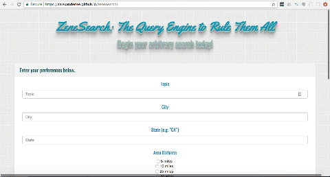
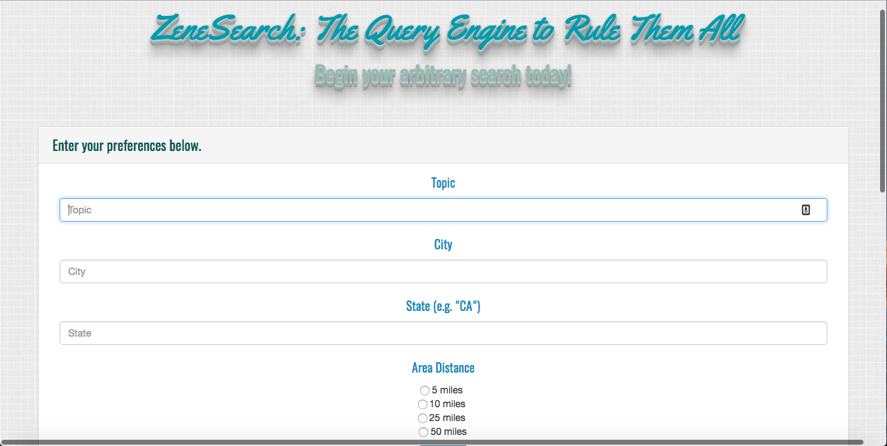
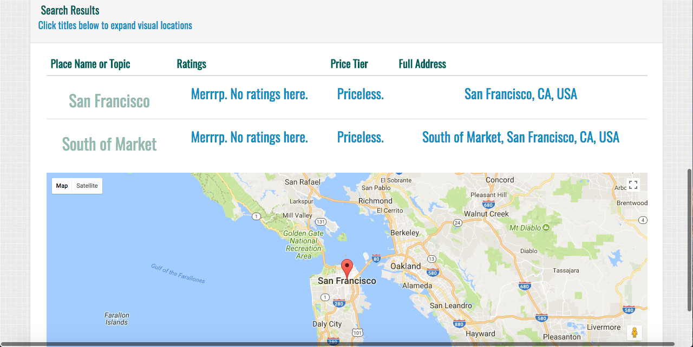

# ZeneSearch | The Query Engine to Rule Them All!

ZeneSearch => is a basic query search engine web application that allows users to search by parameters and preferences for nearby places, services and landmarks most relevant to the topic search in correlation to distance specifications.

## Here is a quick demo of ZeneSearch:

## Here is the Github deployment link:
https://aalexanderlee.github.io/zenesearch/

## Major Tools, Features or Methods Used:
Google GeoCoder, Places and Maps API services were use to translate place proximities from city name searches to {latitude, longitude} coordinate pairings most applicable to the user input search criteria. Google Firebase was used to store data from the user sessions. The Google API was also accessed for library font specific qualities. The Green Sock library was used to animate the title of this engine. The map and initial central marker begins in Tokyo, JP, and pans elsewhere depending on the parameter specifications entered. All listed links and map markers will pull external data and open external searches using the user results.

## ZeneSearch Landing Page Images:
* Page 1:

* Page 2:

## Worth Noting & Issues Faced:
The Google API platform does not support any typically conventional methods for data requests, responses and/or callback methods using $.ajax, CORS, or axios. It is also incompatible with any external package.json add-ons that would otherwise help access other API databases. Foundational functions must be used from documentations then added within correct scopes and formatting to fit the apps specific request needs and callback requirements to run optimally.

# Happy ZeneSearching!
